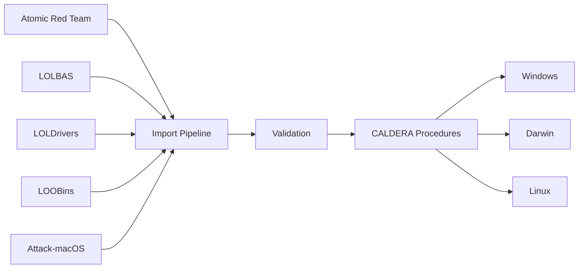

# Caldera Abilities Library

The CALDERA Abilities is a library **ready-to-deploy** procedures and payloads from [Atomic Red Team](https://github.com/redcanaryco/atomic-red-team), [LOLBAS Project](https://github.com/LOLBAS-Project/LOLBAS), [LOLDrivers](https://github.com/magicsword-io/LOLDrivers), and [Attack-macOS](https://github.com/armadoinc/attack-macOS). All abilities are mapped to the MITRE ATT&CK knowledge base.

## What's Included

- **2,948+ Procedures** for Windows, macOS, and Linux
- **MITRE ATT&CK mapping** - Each procedure links to specific techniques
- **Multiple sources** - Commands from five security research projects
- **Automatic updates** - Scripts import new procedures automatically
- **Validation** - All procedures tested before inclusion

## Import FLow

## Support

- **Issues**: [GitHub Issues](https://github.com/yourusername/caldera-procedures-library/issues)
- **Discussions**: [GitHub Discussions](https://github.com/yourusername/caldera-procedures-library/discussions)
- **Documentation**: This wiki 
- 
## Sources
| Source | Description | Platform |
|--------|-------------|----------|
| [Atomic Red Team](https://github.com/redcanaryco/atomic-red-team) | Adversary emulation test library mapped to MITRE ATT&CK | All |
| [LOLBAS Project](https://github.com/LOLBAS-Project/LOLBAS) | Windows Living Off The Land Binaries and Scripts | Windows |
| [LOLDrivers](https://github.com/magicsword-io/LOLDrivers) | Malicious and vulnerable Windows drivers | Windows |
| [LOOBins](https://www.loobins.io/) | macOS Living Off the Orchard Binaries | macOS |
| [Attack-macOS](https://github.com/armadoinc/attack-macOS) | macOS post-exploitation scripts and techniques | macOS |

## Contributing

Contributions are welcome!

1. Fork the repository
2. Create a feature branch
3. Ensure all abilities follow the standardized YAML format
4. Validate your abilities using the provided schema
5. Submit a pull request with a clear description

## Acknowledgements

This library builds upon the work of several open source security projects:

- **[Red Canary Atomic Red Team](https://github.com/redcanaryco/atomic-red-team)** 
- **[LOLBAS Project](https://github.com/LOLBAS-Project/LOLBAS)** 
- **[MagicSword LOLDrivers](https://github.com/magicsword-io/LOLDrivers)**
- **[LOOBins](https://www.loobins.io/)** 
- **[ARMADO Attack-macOS](https://github.com/armadoinc/attack-macOS)** 

## License

Apache License 2.0 - [LICENSE](LICENSE)

