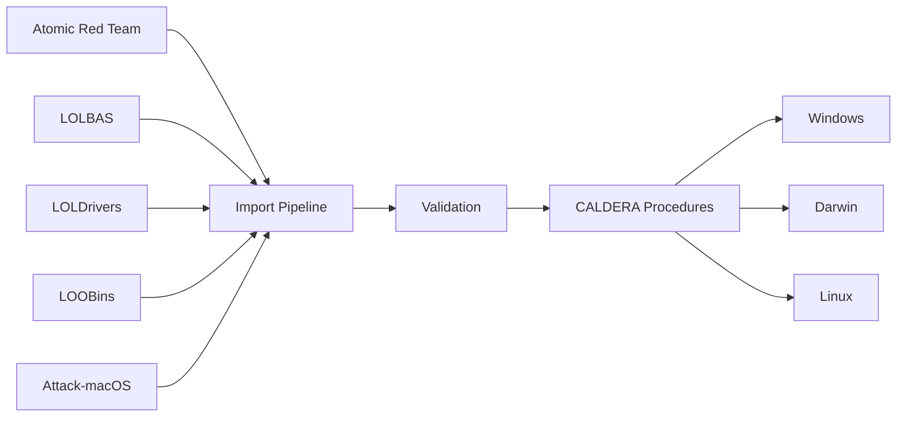

# CALDERA Procedures Library

This library contains procedures that run on CALDERA platforms. The procedures execute commands on Windows, macOS, and Linux systems. All procedures map to MITRE ATT&CK techniques.

## What's Included

- **2,948+ Procedures** for Windows, macOS, and Linux
- **MITRE ATT&CK mapping** - Each procedure links to specific techniques
- **Multiple sources** - Commands from five security research projects
- **Automatic updates** - Scripts import new procedures automatically
- **Validation** - All procedures tested before inclusion

## Architecture

## Sources

| Source | Procedures | Description |
|--------|------------|-------------|
| [Atomic Red Team](sources/atomic-red-team/) | 2,273 | Security testing commands mapped to MITRE ATT&CK |
| [LOLBAS Project](sources/lolbas/) | 400+ | Windows system binaries that can execute commands |
| [LOLDrivers](sources/loldrivers/) | 100+ | Windows drivers with security vulnerabilities |
| [LOOBins](sources/loobins/) | 50+ | macOS system binaries that can execute commands |
| [Attack-macOS](sources/attack-macos/) | 125+ | macOS command scripts and techniques |

## Support

- **Issues**: [GitHub Issues](https://github.com/yourusername/caldera-procedures-library/issues)
- **Discussions**: [GitHub Discussions](https://github.com/yourusername/caldera-procedures-library/discussions)
- **Documentation**: This wiki 